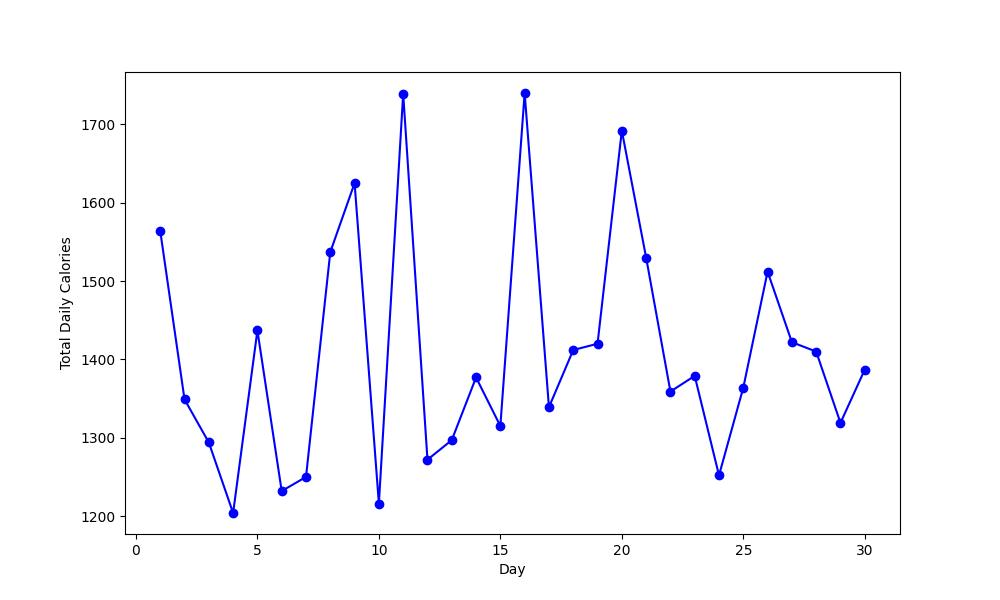
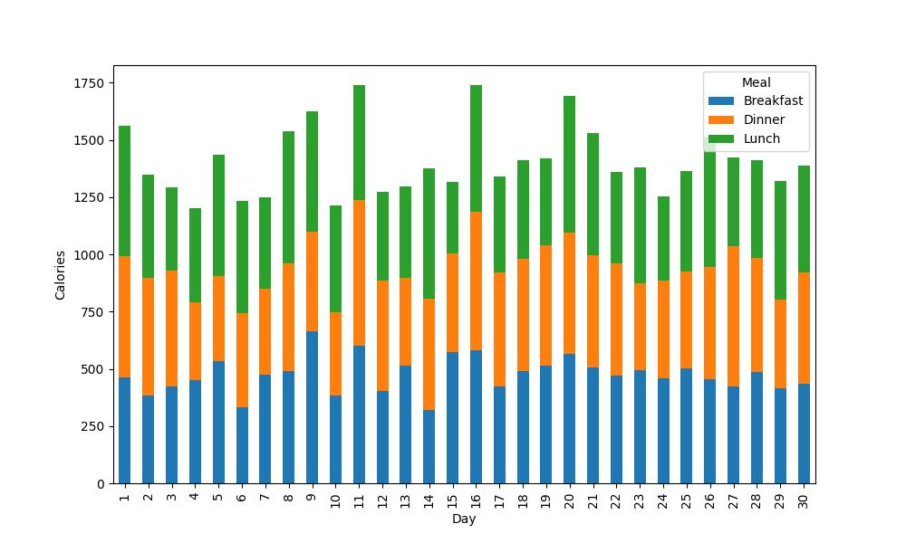
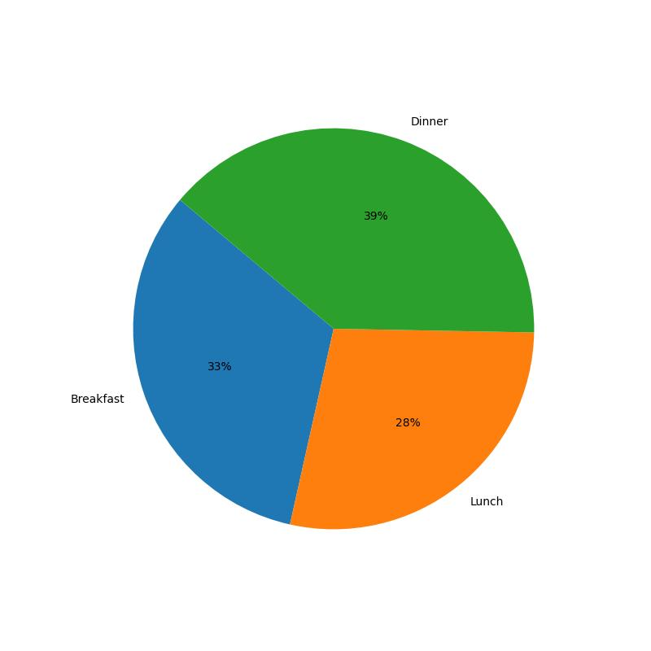

# 第四次作業

- **目標**: 請根據給定的 csv 檔，進行以下資料視覺化結果生成
    1. 找出過去三十天內每日卡路里攝取量，並生成折線圖。
    2. 找出過去三十天三餐卡路里攝取量，並生成堆疊長條圖。
    3. 找出使用者輸入天數的卡路里攝取量，並生成圓餅圖，呈現三餐分別佔當日攝取量比例。

- **輸出檔名**: 所有圖表皆需匯出成 `jpg 檔`，並依照指定名稱命名
    1. 過去三十天內每日卡路里攝取量折線圖: `001.jpg`
    
    2. 過去三十天三餐卡路里攝取量堆疊長條圖: `002.jpg`
    
    3. 使用者輸入某天的Breakfast、Lunch、Dinner卡路里攝取量比例圓餅圖，如輸入3可以得到: `003.jpg`
    

## 輸入格式

### 輸入有1行為一整數。
- 若輸入的是-1輸出過去三十天內每日卡路里攝取量折線圖為`001.jpg`。
- 若輸入的是-2輸出過去三十天三餐卡路里攝取量，並依Breakfast、Lunch、Dinner生成堆疊長條圖為`002.jpg`。
- 若輸入為一介於 1 至 30 之間的整數，輸出Breakfast、Lunch、Dinner卡路里攝取量比例圓餅圖為`003.jpg`。
- 不考慮上述之外的輸入數字。

## 數據輸入範例

```text
3
```

## 輸出格式

此題無文字輸出，僅有檔案輸出到同一工作目錄，檔案名稱請參照上述說明。

## 部分圖表設定

1. 折線圖
```
plt.xlabel("Day") # x 軸標籤
plt.ylabel("Total Daily Calories") # y 軸標籤
plt.figure(figsize=(10, 6))
```

2. 堆疊長條圖
```
plt.xlabel('Day') # x 軸標籤
plt.ylabel('Calories') # y 軸標籤
mealsPivot.plot(kind='bar', stacked=True, figsize=(10, 6))
```

3. 圓餅圖
```
df = 

# 注意在取比例的時候不要有小數點，一律四捨五入到整數位
plt.pie(data=df, labels=df.index, autopct='%.0f%%', startangle=140)
plt.figure(figsize=(10, 6))
```

## 輸出格式
- 圖表不用設定標題。
- 圖表一律以預設格式生成 **(不要修改圖像大小以及顏色)**。

## Hint
- 本次的作業是要讓各位練習從 csv 檔中擷取出需要的數據並生成圖表，以進行資料視覺化。
- 最後還是要再度提醒，在繳交作業前一定要再三檢查，檔案名稱的格式有沒有打對，程式也要測試輸出格式是否與範例完全一致喔！
- 記得程式中不可以有 `plt.show()`，否則會造成自動批改因顯示圖表卡住而超時得到 0 分喔！